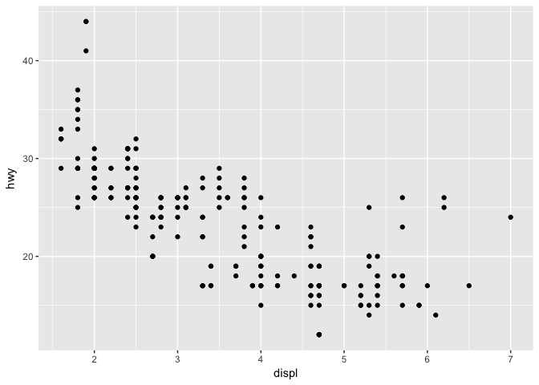
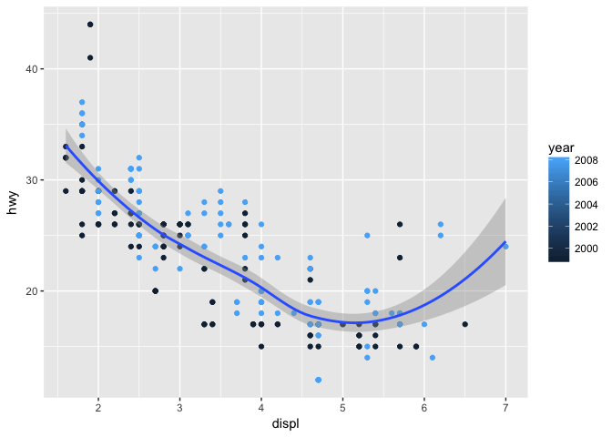

seminar2b
================
Daniel He
10/1/2018

MPG Summary
===========

``` r
library(tidyverse)
```

    ## ── Attaching packages ─────────────────────────────────────────────────────────── tidyverse 1.2.1 ──

    ## ✔ ggplot2 2.2.1     ✔ purrr   0.2.4
    ## ✔ tibble  1.3.4     ✔ dplyr   0.7.4
    ## ✔ tidyr   0.7.2     ✔ stringr 1.2.0
    ## ✔ readr   1.1.1     ✔ forcats 0.2.0

    ## ── Conflicts ────────────────────────────────────────────────────────────── tidyverse_conflicts() ──
    ## ✖ dplyr::filter() masks stats::filter()
    ## ✖ dplyr::lag()    masks stats::lag()

``` r
summary(mpg)
```

    ##  manufacturer          model               displ            year     
    ##  Length:234         Length:234         Min.   :1.600   Min.   :1999  
    ##  Class :character   Class :character   1st Qu.:2.400   1st Qu.:1999  
    ##  Mode  :character   Mode  :character   Median :3.300   Median :2004  
    ##                                        Mean   :3.472   Mean   :2004  
    ##                                        3rd Qu.:4.600   3rd Qu.:2008  
    ##                                        Max.   :7.000   Max.   :2008  
    ##       cyl           trans               drv                 cty       
    ##  Min.   :4.000   Length:234         Length:234         Min.   : 9.00  
    ##  1st Qu.:4.000   Class :character   Class :character   1st Qu.:14.00  
    ##  Median :6.000   Mode  :character   Mode  :character   Median :17.00  
    ##  Mean   :5.889                                         Mean   :16.86  
    ##  3rd Qu.:8.000                                         3rd Qu.:19.00  
    ##  Max.   :8.000                                         Max.   :35.00  
    ##       hwy             fl               class          
    ##  Min.   :12.00   Length:234         Length:234        
    ##  1st Qu.:18.00   Class :character   Class :character  
    ##  Median :24.00   Mode  :character   Mode  :character  
    ##  Mean   :23.44                                        
    ##  3rd Qu.:27.00                                        
    ##  Max.   :44.00

Including Plots
---------------

#### Dot plot and jitter plot



#### Color = class


#### size = class

    ## Warning: Using size for a discrete variable is not advised.


#### blue dots


ggplot(data = <DATA>) + <GEOM_FUNCTION>( mapping = aes(<MAPPINGS>), stat = <STAT>, position = <POSITION> ) + <COORDINATE_FUNCTION> + <SCALE_FUNCTION> + <AXIS_FUNCTION> + <FACET_FUNCTION>

`geom_smooth()` using method = 'loess'
--------------------------------------


    ## `geom_smooth()` using method = 'loess'



Bar chart
---------

| class      |  fuel\_efficiency|
|:-----------|-----------------:|
| 2seater    |          24.80000|
| compact    |          28.29787|
| midsize    |          27.29268|
| minivan    |          22.36364|
| pickup     |          16.87879|
| subcompact |          28.14286|
| suv        |          18.12903|

``` r
ggplot(averageEfficiency) + 
  geom_bar(aes(x = class, y = fuel_efficiency),
           stat = "identity")
```


``` r
ggplot(averageEfficiency) + 
  geom_bar(aes(x = class, y = fuel_efficiency, fill = class),
           stat = "identity")
```


``` r
ggplot(averageEfficiency) + 
  geom_bar(aes(x = class, y = fuel_efficiency, fill = class),
           stat = "identity") +
  ylab("Fuel Efficiency (miles per gallon)") +
  xlab("Vehicle Type")
```


``` r
ggplot(averageEfficiency) + 
  geom_bar(aes(x = class, y = fuel_efficiency, fill = class),
           stat = "identity") +
  ylab("Fuel Efficiency (miles per gallon)") +
  xlab("Vehicle Type") +
  scale_y_reverse()
```


``` r
ggplot(averageEfficiency) + 
  geom_bar(aes(x = class, y = fuel_efficiency, fill = class),
           stat = "identity") +
  coord_flip()
```


``` r
ggplot(averageEfficiency) + 
  geom_bar(aes(x = class, y = fuel_efficiency, fill = class),
           stat = "identity") +
  coord_polar()
```


### facet wrap


Deliverable
===========

``` r
ggplot(data = mpg) + 
  geom_point(mapping = aes(x = displ, y = hwy, size = class, colour = drv))
```

    ## Warning: Using size for a discrete variable is not advised.


